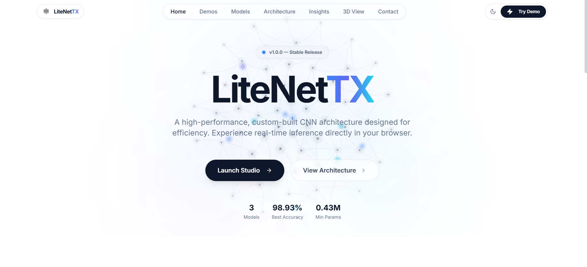
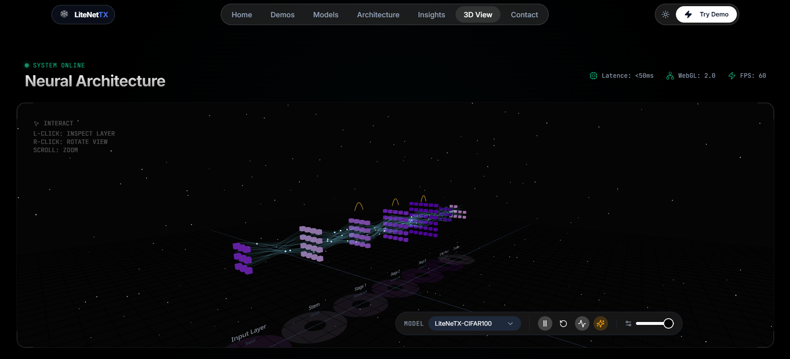

<div align="center">

# ⚡ LiteNeTX Backend

**FastAPI · PyTorch · CPU-Optimized CNN Inference**

[](https://fastapi.tiangolo.com/)
[](https://www.python.org/)
[](https://pytorch.org/)
[](https://numpy.org/)

<br />

🌐 [Live Demo](https://litenetx.in) · 🎥 [Demo](https://youtu.be/wyhVdyEy1v0) · 📝 [Kaggle Writeup](https://www.kaggle.com/writeups/ameyac11/litenetx) · 🔗 [DOI](https://doi.org/10.34740/kaggle/w/86629)

<br />

### 📸 Preview

<table align="center">
  <tr>
    <td align="center" width="50%">
      <a href="https://youtu.be/wyhVdyEy1v0">
        
      </a>
      <br />
      <sub><b>🏠 Home Page</b> · <a href="https://youtu.be/wyhVdyEy1v0">Watch Demo</a></sub>
    </td>
    <td align="center" width="50%">
      <a href="https://youtu.be/wyhVdyEy1v0">
        
      </a>
      <br />
      <sub><b>🧪 Model Playground</b> · <a href="https://youtu.be/wyhVdyEy1v0">Watch Demo</a></sub>
    </td>
  </tr>
</table>

</div>

<br />

The core API for **LiteNeTX** — a lightweight CNN family developed entirely from scratch, with no pretrained models or transfer learning. Serves real-time inference for FashionMNIST, CIFAR-10, and CIFAR-100 over a FastAPI REST interface.

**Related repository:** [LiteNeTX Frontend](https://github.com/ameyac11/LiteNeTX_Frontend) — React UI for architecture exploration and the model playground.

---

## 📖 About

LiteNeTX ships three PyTorch models trained from scratch on standard vision benchmarks. Weights are loaded via Safetensors at startup; inference is optimized for CPU deployment in production while models were trained on GPU.

| Model | Dataset | Architecture |
|:---|:---|:---|
| LiteNeTX-FMNIST | FashionMNIST | Stacked conv blocks · BatchNorm · Dropout |
| LiteNeTX-C10 | CIFAR-10 | Residual blocks · 3-stage downsampling |
| LiteNeTX-C100 | CIFAR-100 | Wide SE-ResNet · DropPath regularization |

**Training hardware:** NVIDIA Tesla T4 ×2 (30 GB VRAM)

---

## ✨ Features

- 🛠️ **Built From Scratch** — LiteNeTX CNNs designed and trained from scratch — no pretrained weights
- 🧠 **Three LiteNeTX Models** — FashionMNIST · CIFAR-10 · CIFAR-100
- ⚡ **CPU-Optimized Inference** — PyTorch CPU builds with minimal memory overhead
- 📤 **Image Upload API** — Multipart endpoints for real-time classification
- 🔥 **Model Warm-up** — Preloads weights on startup for faster first response
- 🖼️ **Example Gallery** — Serves curated sample images per model
- 📊 **Top-K Predictions** — Confidence scores with ranked class labels
- 🩺 **Health Checks** — Service status and model availability endpoints
- 🌐 **Production CORS** — Configured for litenetx.in and Vercel deployment

---

## 🛠️ Tech Stack

| | |
|:---:|:---|
| ⚡ | **FastAPI** · Uvicorn · Pydantic |
| 🔥 | **PyTorch** · TorchVision — CPU inference |
| 💾 | **Safetensors** — model weight loading |
| 🖼️ | **Pillow** — image preprocessing |
| 🔢 | **NumPy** — tensor operations |

---

## 🚀 Quick Start

```bash
python -m venv .venv
.venv\Scripts\activate          # Windows
# source .venv/bin/activate     # macOS / Linux

pip install -r requirements.txt
uvicorn app.main:app --reload
```

🌐 API → `http://localhost:8000`  
📖 Docs → [`/docs`](http://localhost:8000/docs) · [`/redoc`](http://localhost:8000/redoc)  
🎨 Frontend → [LiteNeTX_Frontend](https://github.com/ameyac11/LiteNeTX_Frontend)

---

## 🌟 Support

If you find this project useful or interesting, please consider giving it a ⭐ on GitHub! Your support helps make the project more visible and encourages further development.

---

## 📜 License

[](./LICENSE)

Licensed under the **GNU Affero General Public License v3.0 (AGPL-3.0)**.  
Copyright © 2026 Ameya Sanjay Chopade · See [LICENSE](./LICENSE) for details.
